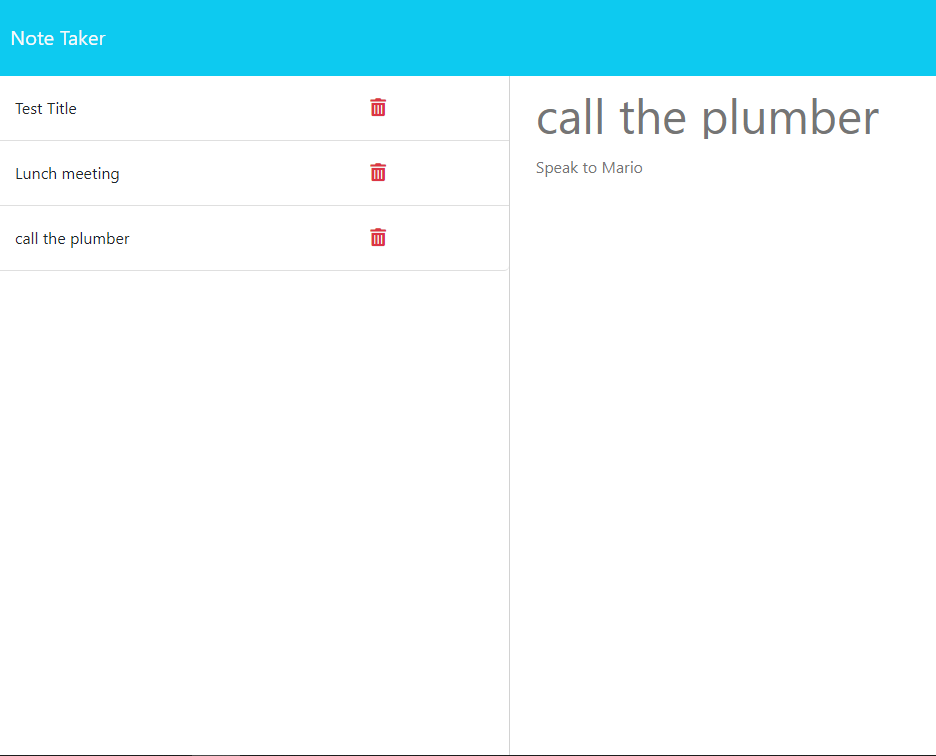

# Pocket Memo Taker

# Description
an easy app that lets you save or delete notes
## Table of Contents 
* [Installation](#installation)
* [Usage](#usage)
* [License](#license)
* [Contributing](#contributing)
* [Questions](#contacts)
## Installation
npm i
## Usage
node and express 

* Launch from Heroku
<a href="https://pocket-memo-taker.herokuapp.com/"
target="_blank">Deployed!</a>

## Contacts
* Email: joeyblue27@gmail.com 
* GitHub: joeyblue27

## License
This project is licensed under the MIT license. 

